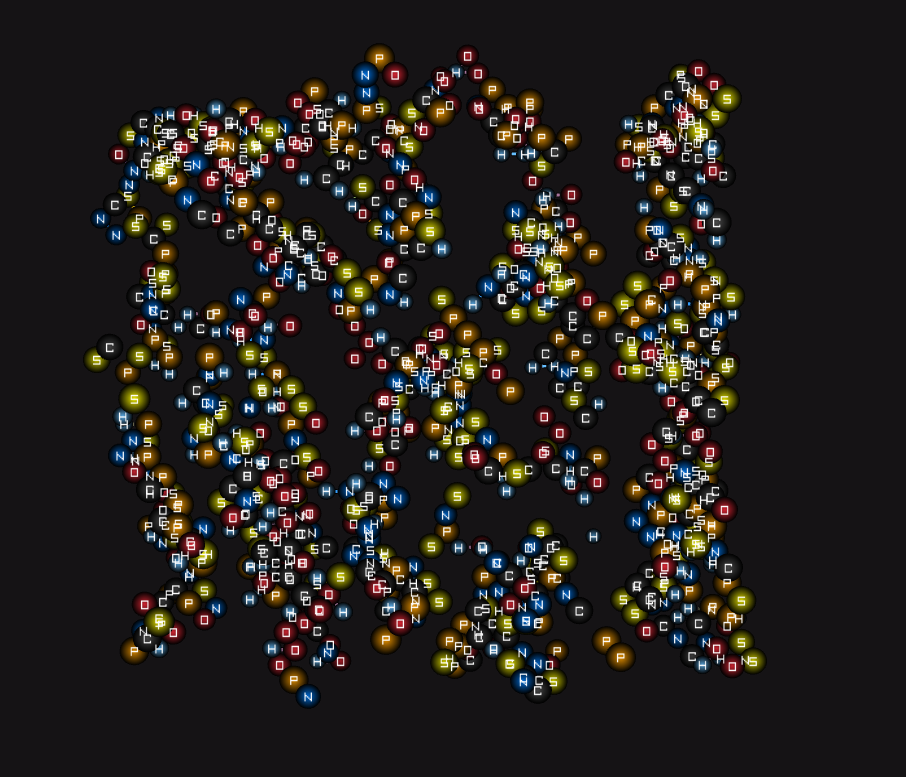

# 🧪 LifeSimulator C++

**High-Performance Molecular Evolution Engine**

This project is the evolution of `LifeSimulator` from Python to C++. The goal is to achieve a massive hardware-accelerated chemical physics simulation with a minimalist and functional "Nano-HD" aesthetic.


*Emergent molecular chain formation using VSEPR physics and Coulomb forces*

## 🕹️ Main Controls

- **WASD**: Navigate the environment.
- **Mouse Wheel**: Zoom control (smooth transitions).
- **Left Click**: Activate Tractor Beam (surgical atom capture).
- **Right Click**: **Detach atom** (hierarchical undo) / **Free pan** (hold).
- **Spacebar**: Center camera on Avatar + Open Element Inspector.
- **Double Spacebar**: Open Molecule View.
- **F1**: Toggle language (English/Spanish).
- **F11**: Fullscreen.

## ✨ Key Features

- **Multilingual Support**: Full English/Spanish localization with runtime toggle (**F1**).
- **Mass-Based Inertia**: Simulation uses $F=ma$; heavy elements feel heavier.
- **High-Performance Bonding**: O(1) slot detection algorithm for massive molecules.
- **Real Chemical Physics**: Engine based on scientific rules (Electronegativity, Coulomb, Hooke).
- **Smart Chemistry**: Atoms respect total valences and allow **auto-accommodation** (Splice Bonding).
- **Elastic Bonds**: Molecules vibrate and can break under stress (except player's molecule).
- **Soft-Capture Tractor**: Precision capture with progressive braking and elastic damping.
- **Smooth Docking**: Smooth animation when atoms dock to molecules.
- **Ball-and-Stick Visualization**: Bonds with blended colors and depth shadows.
- **Persistent Logging**: All events are saved to `session.log`.

## 🚀 Technical Vision
- **Engine**: C++17 with Raylib 5.0 (High-DPI enabled).
- **Architecture**: Clean ECS (Entity Component System).
- **Aesthetic**: "LORE-CORE" / Nano-HD (compact scaling, ultra-crisp typography).
- **UI**: Modular `UIWidgets` system for visual consistency.

## 📂 Structure

```
LifeSimulatorCPP/
├── src/
│   ├── core/           # Config, MathUtils, Localization, ErrorHandling
│   ├── ecs/            # World, Components
│   ├── physics/        # PhysicsEngine, BondingSystem, SpatialGrid, RingChemistry
│   ├── chemistry/      # ChemistryDatabase, StructureRegistry
│   ├── gameplay/       # Player, TractorBeam, MissionManager
│   ├── rendering/      # Renderer25D, CameraSystem
│   ├── ui/             # Inspector, HUD, Quimidex, UIWidgets
│   ├── input/          # InputHandler
│   └── world/          # Zones (ClayZone)
├── data/               # JSON: elements, molecules, structures, localization
├── tests/              # Integration tests (doctest)
├── docs/               # Documentation
└── external/           # Raylib 5.0
```

📖 **Additional Documentation:**
- [BUILDING.md](docs/BUILDING.md) - Build instructions
- [ARCHITECTURE.md](docs/ARCHITECTURE.md) - System diagram

## 🛠️ Updated Roadmap
- [x] **Phase 5**: ECS & Render Base
- [x] **Phase 6**: Visual Redesign & Nano-HD Interaction
- [x] **Phase 7**: Master Alchemy (CHNOPS, VSEPR, Dynamic UI)
- [x] **Phase 8**: System Hardening & Deep Optimization
- [x] **Phase 10**: Autonomous Molecular Evolution
- [x] **Phase 11**: Bond Visualization Polish
- [x] **Phase 12**: Smooth Docking & Notifications
- [x] **Natural Chemistry**: Coulomb, Electronegativity, Elastic Bonds
- [x] **Tractor Refinement**: Valence Shield, Sticky Capture, Hierarchical Undo
- [x] **Architecture Hardening**: JSON DB, Player Refactor, VSEPR Validation
- [x] **Phase 17**: Deep Audit (Mass Physics, O(1) Bonding, Bilingual UI)
- [x] **Phase 30**: Architectural Standardization (De-God-Class, ErrorHandler)
- [x] **Phase 31**: Test Coverage & Code Quality (43 tests, Comment Standardization)
- [ ] **Phase 18**: Chemical Expansion (Transition Metals, Complex Organics)
- [ ] **Phase 19**: Exotic States (Plasma, Supercritical Fluids)
- [ ] **Phase 20**: Bio-Genesis (ATP, Initial Metabolism)

---
*Based on the original LifeSimulator Python design.*
